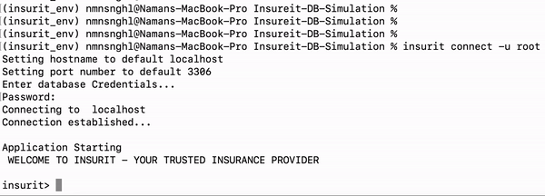

# Insureit - Insurance Provider Simulation
A CLI-based system developed to facilitate the sale of automobiles and homeowners' insurance to clients, all while effectively overseeing the interactions with agents and admin. It goes beyond basic transactions, introducing features like dynamic premium computation, private agent portals, and an analytical dashboard. The user-friendly CLI, backed by advanced database techniques, ensures intuitive interactions for diverse user types.

## Jump to
+ [Setting up the Application](#setup)
   + Prerequisites
   + Database Setup
   + Virtual Environment Setup
   + Installing Insurit
+ [Starting Application](#start)
+ [Features and Commands](#cmd)
   + Root Commands
   + Agent Commands
   + Customer Commands
+ [Backend](#backend)
   + Schema Diagram
   + Entity/Table Description
   + Database Triggers
   + Database Functions
   + Stored Procedures
   + Views

## Setting Up the Application 
### Prerequisites
Before we can begin setting up the application, ensure that the following requirements are met:
1. **Download the application** from here to your local machine.
2. **MySQL Database and Client:**
   Make sure you have a MySQL database installed along with a client for interaction.
3. **Python Installation:**
   Ensure Python is installed on your machine.
4. **Virtual Environment:**
   Set up a virtual environment, preferably using Conda.
5. **Package Manager:**
   Have a package manager installed, such as pip or Conda.

Now, you can proceed with the following main steps to set up the project:

### Setting up Database on MySQL
To find all the SQL scripts for setup go to the local path insurit/backend/sql_scripts from the main folder Insureit-DB-Simulation on your system. This sub-folder contains all the DDL, Triggers, SP, Functions, Views, and DML scripts.
We will execute the following scripts before we start inserting data. All the below paths are relative to the sub-folder `insurit/backend/sql_scripts`:
1. **create_ddl.sql**
   - Running this script will create a schema `insurit` on the database along with DDLs of all the tables.
   - Note: This script also inserts the default credentials for the root user.
2. **Creating all Triggers**
   1. `/Triggers/gen_creds_trigg.sql`
3. **Creating all Functions**
   1. `/Functions/calPremium.sql`
   2. `/Functions/create_auth_func.sql`
   3. `/Functions/function_getcustomerdetails.sql`
4. **Creating all Stored Procedures**
   1. `/SP/CreateNewClaim_SP.sql`
   2. `/SP/addNewPolicy_SP.sql`
   3. `/SP/insertdata_sp.sql`
5. **Creating all Views**
   1. `/Views/agentPerformance.sql`
   2. `/Views/pending_claims.sql`
   3. `/Views/view_my_policy.sql`

Once we have the basic setup we can insert all the data into our tables. To do so we can either login to insurit application as root user and execute the command `database --reset RESET` which inserts all the data using the stored-procedure or we can execute .sql files in the following order.
1. *customers.sql*
2. *agents.sql*
3. *autopolicy_detail.sql*
4. *homepolicy_detail.sql*
5. *finance_details.sql*
6. *loan.sql*
7. *policy_holder.sql*
8. *vehicle_details.sql*
9. *home_details.sql*
10. *transactions.sql*
11. *claim.sql*
12. *report.sql*
13. *report_details.sql*

### Setting up Conda Virtual Environment
The main folder of the project has an *`environments.yml`* file which contains a list of all the packages we need to install in the virtual environment. When working on Anaconda/Conda it is straightforward to use this file and create a virtual Environment.
In Terminal or Command Prompt run the following command `conda env create -f environments.yml`
This command uses the environments.yml file to create a new virtual environment in Anaconda - insurit_env - and downloads all the required python packages in that environment. Once it has been executed we have fulfilled all package installation requirements to run Insurit. 

`conda activate insurit_env`- with this command we can enable the virtual environment and follow steps further.

### Installing Insurit as a Package
The main folder of the project contains two setup files - `install.bat` and `install.sh`. For windows PC we will run the `install.bat` file in command prompt and for linux based system and Macs we run the command bash `install.sh` in terminal. Make sure these files are run inside the virtual environment.

## Starting the application 
Once the application and all the setup steps are completed we can check the application installation by executing the following commands on terminal/command prompt
- `conda activate insurit_env`
- `insurit --help`
The `--help` is expected to list a help page to start the application. In case this fails we can still run the application by running the *_\_main__.py* file directly.
To start the application we can run `insurit connect` command and provide it with username and password to the database.
The `logout` and `exit` commands can be used to logout of a user and exit the application respectively.

## Features and Commands 
There are 3 main types of end users for the application - customer, agent, and administrator. Each of these users have access to features according to their permission levels with Admin being the highest, then agent, and customer. The admin user role is the only one who can manipulate the database from the application to reset data. Below are a list of features for each user role along with their commands.

### Root/Administrator:
To login to Insurit as a root we can execute command `root -u root -p root` after starting the application. The default username and passwords are root.

As a root user the following operations can be performed.
* **_Manage Agents_**: Managers have the authority to manage agents, including the addition of new agents to the system and overseeing their performance.
 `agent --new` - Creating new agent
* **_Access Performance Dashboard_**: The application provides managers with a comprehensive performance dashboard, offering insights into agent performance and overall system metrics.
 `agent --performance` - View a static dashboard
* **_Manage Claims_**: Managers can efficiently manage insurance claims, overseeing the processing, approval, and resolution of claims within the system.
 `claims --pending` - View all pending claims
 `claims --approved` - View all approved claims
* **_Maintain Database_**: Managers have full control over the database, allowing them to perform tasks such as resetting the database, ensuring data integrity and system functionality.
  `database --reset RESET` - Reset database

### Agents:
To login to Insurit as an agent we can execute command `agent -u stefa -p 'stefa cours'` after starting the application
The default username is the first name of the agent in lowercase and the password is the full name in lower case. In the above command replace the username and password with any other agent’s credentials to login as a different user.

As an agent user the following operations can be performed.
* **_View and Manage Clients_**: Agents can efficiently view and manage their client portfolio, providing them with a comprehensive overview of their customer base.
  `client --new` - Create a new client account
  `client --show` - Show all clients managed by current logged in agent
* **_Calculate Premium_**: Agents have a premium calculation feature, allowing them to assess and determine insurance premiums for potential customers based on various parameters.
  `policy --calc-premium` - Calculate premium for a policy
* **_Identify Policies at Risk_**: The application empowers agents to identify policies that are at risk, enabling proactive management and mitigation of potential issues.
  `policy --at-risk` - View policies which are at risk of due payment
* **_Add New Policies_**: Agents can easily add new policies to the system.
  `policy --add-new` - Add a new policy

### Customers:
To login to Insurit as a customer we can execute command `login -u rochette -p 'rochette dowglass'` after starting the application
The default username is the first name of the customer in lowercase and the password is the full name in lower case. In the above command replace the username and password with any other customer’s credentials to login as a different user.

As a client user the following operations can be performed.
* **_View Policies_**: Customers can easily access and view details of their insurance policies, providing transparency and ensuring they stay informed about their coverage.
  `my-policies` - Show policies owned by customer
* **_Pay Premium_**: The application enables customers to conveniently pay their insurance premiums online, ensuring a seamless and efficient payment process.
  `pay` - Make payment for premium
* **_Create New Claim_**: Customers have the functionality to initiate and submit new insurance claims through the application, streamlining the claims process.
  `claim --new` - Create new claim under some policy owned
* **_Check Claim Status_**: Customers can effortlessly check the status of their insurance claims, offering real-time updates on the progress and resolution of their claims.
  `claim --view` - View all claims raised by customer
* **_Maintain Account Information_**: Customers have the ability to manage and update their account information, including email addresses, phone numbers, and addresses, ensuring accurate and up-to-date records.
  `account-settings`
   Or use one of its options to skip menu
  `account-settings [--email ||--phone ||--address]` - Edit account details

## Backend 

### Schema Diagram

### Entity/Table Description:
* _Customers_ - It stores all the PII and general information about customers.
* _Agents_ - It stores information of employees who are designated to the role of an Agent in Insurit.
* _Secrets_ - This table stores the username and hashed (SHA256) password for all users - admin, customers and agents. This table is populated by Triggers and is not connected with any other table to keep it isolated.
* _Policy\_Holder_ - Each customer can either hold an automotive/Vehicles or home policy. One customer can have multiple of these policies. This table stores information on policies a customer holds.
Each policy has its unique number which maps it to a customer and agent. This is a core table which holds the system together
* _HomePolicy\_Details_ - Insurit provides certain policies to its users for purchase or hold until expiry. This table contains details of all Home Insurance policies offered (currently active) and the once offered in the past (inactive policies).
* _AutoPolicy\_Details_ - Similarly like HomePolicy this table holds details of all Auto/Vehicle Insurance policies offered (currently active) and the once offered.
* _Vehicle\_Details_ - Each Insurance policy Policy_Holder ID insures an asset. This table stores the details of vehicle assets for auto policies.
* _Home\_Details_ - Similarly, this table contains the details of Home assets for home policies.
* _Claim_ - During an unfortunate loss or damage of an asset which is insured by Insurit policies, the customer can create a claim for some amount. This table stores the details of these claims and their status.
* _Report_ - In case the damage to the asset has a corresponding Law Suit or Police report then we save it in this table.
* _Report_Details_ - This table is an extension to the Report table with additional information.
* _Transactions_ - All premiums paid to Insurit against some policy is stored in this table.
* _Loan_ - This table saves all the mortgage and loan related information for the assets.
* _Finance_Details_ - When a customer makes payment against some policy then we store all their payment methods in this table for quicker transactions.

### Database Triggers
* _generate\_credentials_ - This trigger is to automate the process of generating secure credentials for new customers within the insurance application. This trigger operates on the principle of enhancing data security by hashing the customer's name using the SHA2 hashing function. Upon the insertion of a new customer record, the trigger dynamically generates a hashed password and subsequently inserts a new record into the SECRETS table. This record includes a unique username and the hashed password, ensuring a robust and secure authentication mechanism for customer access to the system.
* _generate\_agent\_credentials_ - This trigger serves a parallel purpose, specifically tailored for the generation of credentials for new agents joining the insurance system. Like its counterpart for customers, this trigger employs a secure approach to credential creation.

### Database Functions
* _CalculatePremium()_ - The function serves to compute insurance premiums by considering policy type, sum assured, tenure, and the age of the policyholder. Its parameters include policy_id, age, sum_assured, tenure, and policy_type. This function applies a predefined logic to determine a base premium, subsequently adjusting it based on age categories.
* _Auth()_ - The "auth" function operates as an authentication mechanism for user credentials and permissions. It takes parameters such as USR (Username), PSWD (Password), and PERMISSION (Permission level). The function generates a hashed password and validates the provided credentials and permissions against the database, returning a binary result.
* _GetCustomersForAgent()_- The "GetCustomersForAgent" function retrieves customer details associated with a specific agent, taking agentID as its parameter. Utilizing a JOIN operation on relevant tables, this function compiles customer information into a formatted result.

### Stored Procedures
* _insertdata_ - This stored procedure is used to perform the basic INSERT operation into various tables of our database. It is used to set up the initial database for performing operations on our application. The administrator can also use this stored procedure to reset the data after changes have been made to the database.
* _AddNewPolicy_ - The "AddNewPolicy" procedure adds a new insurance policy dynamically to a specified policy table. With parameters like policy_name, policy_type, description, policy_active_flag, sum_assured, tenure, and policy_table, this procedure constructs and executes a SQL query to facilitate policy addition.
* _CreateNewClaim_ - The "CreateNewClaim" procedure facilitates the creation of new insurance claims with parameters including p_Claim_amount, p_Date, and p_Holder_id. This straightforward procedure directly inserts a new claim record with the provided claim amount, date, and policy holder ID.

### Views
* _AgentPerformance_ - "AgentPerformance" provides an overview of agent performance, displaying Agent_id, Agent_Name, Num_Customers, Num_Policies, and Total_Sales. This view employs JOIN operations on various tables to calculate and aggregate performance metrics for each agent.
* _Pending_Claims_ - The "Pending_Claims" view presents pending insurance claims, showing fields like customer_id, past_rejects, claim_id, claim_date, amount claimed, policy status and policy_at_risk. By retrieving relevant information and utilizing conditional logic, this view identifies and displays pending claims.
* _view_my_policy_: The "view_my_policy" view offers a comprehensive perspective on a customer's insurance policies. It amalgamates information from different tables to present details such as Holder_id, Customer_id, Home_Policy_id, Auto_Policy_id, homePolicyName, autoPolicyName, status_of_policy, StartDate, ExpiryDate, RenewDate, at_risk_flag, and Agent_id.
